# Syniad Deployment Architecture

## Overview
This document describes the deployment architecture for the Syniad application, including frontend Next.js apps, backend API, authentication, and infrastructure components.

## Architecture Diagram

```mermaid
graph TB
    subgraph "Users"
        U1[Web Browser]
    end

    subgraph "CDN & Static Assets"
        CF1[CloudFront<br/>editor.dev.syniad.net]
        CF2[CloudFront<br/>dev.syniad.net]
        S3_EDITOR[S3 Bucket<br/>scenario-editor]
        S3_GAME[S3 Bucket<br/>game]
    end

    subgraph "Frontend Applications (Next.js)"
        LAMBDA_EDITOR[Lambda Function<br/>scenario-editor<br/>Runtime: provided.al2023]
        LAMBDA_GAME[Lambda Function<br/>game<br/>Runtime: provided.al2023]
        WA[Lambda Web Adapter<br/>Layer]
    end

    subgraph "Authentication"
        COGNITO[AWS Cognito<br/>User Pool]
        COGNITO_DOMAIN[Cognito Domain<br/>syniad-dev-auth-dev]
        BA_EDITOR[Better Auth<br/>scenario-editor]
        BA_GAME[Better Auth<br/>game]
    end

    subgraph "API Gateway"
        APIGW[HTTP API Gateway<br/>dev.api.syniad.net]
        AUTHZ[Lambda Authorizer<br/>Validates Cognito JWT]
    end

    subgraph "Backend Lambda Functions"
        LAMBDA_TEST[test]
        LAMBDA_SCENARIOS[scenarios<br/>CRUD operations]
        LAMBDA_GAMES[games<br/>CRUD operations]
    end

    subgraph "Data Storage"
        DDB_SCENARIOS[DynamoDB<br/>scenarios table]
        DDB_GAMES[DynamoDB<br/>games table]
        DDB_PLAYER_GAMES[DynamoDB<br/>player-games GSI]
    end

    subgraph "Documentation"
        LAMBDA_DOCS[Lambda Function<br/>docs]
        SWAGGER[Swagger UI<br/>/docs]
    end

    %% User to Frontend
    U1 -->|HTTPS| CF1
    U1 -->|HTTPS| CF2

    %% CloudFront to S3
    CF1 -->|OAC| S3_EDITOR
    CF2 -->|OAC| S3_GAME

    %% CloudFront to Lambda (for dynamic routes)
    CF1 -.->|API Routes| LAMBDA_EDITOR
    CF2 -.->|API Routes| LAMBDA_GAME

    %% Lambda Web Adapter
    LAMBDA_EDITOR --> WA
    LAMBDA_GAME --> WA

    %% Frontend to Cognito
    BA_EDITOR -->|OAuth 2.0| COGNITO
    BA_GAME -->|OAuth 2.0| COGNITO
    COGNITO --> COGNITO_DOMAIN

    %% Frontend to API
    BA_EDITOR -->|Bearer Token| APIGW
    BA_GAME -->|Bearer Token| APIGW

    %% API Gateway Flow
    APIGW -->|Validates JWT| AUTHZ
    AUTHZ -->|Validates with| COGNITO
    AUTHZ -->|Allows/Denies| APIGW

    %% API Gateway to Backend Lambdas
    APIGW -->|Authorized Requests| LAMBDA_SCENARIOS
    APIGW -->|Authorized Requests| LAMBDA_GAMES
    APIGW -->|Public| LAMBDA_DOCS

    %% Backend Lambdas to DynamoDB
    LAMBDA_SCENARIOS --> DDB_SCENARIOS
    LAMBDA_GAMES --> DDB_GAMES
    LAMBDA_GAMES --> DDB_PLAYER_GAMES

    %% Documentation
    LAMBDA_DOCS --> SWAGGER

    %% Styling
    classDef frontend fill:#e1f5ff,stroke:#01579b,stroke-width:2px
    classDef backend fill:#fff3e0,stroke:#e65100,stroke-width:2px
    classDef auth fill:#f3e5f5,stroke:#4a148c,stroke-width:2px
    classDef storage fill:#e8f5e9,stroke:#1b5e20,stroke-width:2px
    classDef cdn fill:#fff9c4,stroke:#f57f17,stroke-width:2px

    class LAMBDA_EDITOR,LAMBDA_GAME,BA_EDITOR,BA_GAME frontend
    class LAMBDA_SCENARIOS,LAMBDA_GAMES,LAMBDA_DOCS,APIGW backend
    class COGNITO,COGNITO_DOMAIN,AUTHZ,BA_EDITOR,BA_GAME auth
    class DDB_SCENARIOS,DDB_GAMES,DDB_PLAYER_GAMES storage
    class CF1,CF2,S3_EDITOR,S3_GAME cdn
```

## Component Details

### Frontend Applications

#### Scenario Editor (`editor.dev.syniad.net`)
- **Deployment**: Next.js app deployed as Lambda function
- **Runtime**: `provided.al2023` with Lambda Web Adapter
- **Static Assets**: Served from S3 via CloudFront
- **Authentication**: Better Auth with Cognito OAuth
- **API Client**: Calls backend API with Cognito ID token

#### Game App (`dev.syniad.net`)
- **Deployment**: Next.js app deployed as Lambda function
- **Runtime**: `provided.al2023` with Lambda Web Adapter
- **Static Assets**: Served from S3 via CloudFront
- **Authentication**: Better Auth with Cognito OAuth
- **API Client**: Calls backend API with Cognito ID token

### Authentication Flow

1. **User Login**:
   - User clicks login in Next.js app
   - Better Auth redirects to Cognito hosted UI
   - User authenticates with Cognito
   - Cognito redirects back to app with authorization code
   - Better Auth exchanges code for tokens (access, ID, refresh)
   - Tokens stored in Better Auth session (JWT)

2. **API Requests**:
   - Frontend calls `/api/auth/get-session` to get session
   - Extracts Cognito ID token from session
   - Sends API requests with `Authorization: Bearer <id-token>` header
   - API Gateway authorizer validates token with Cognito
   - If valid, request proceeds to backend Lambda

### API Gateway

- **Type**: HTTP API (v2)
- **Domain**: `dev.api.syniad.net`
- **Authorizer**: Lambda authorizer validates Cognito JWT tokens
- **Routes**: All routes (except `/docs`) require authentication
- **CORS**: Configured for frontend domains

### Backend Lambda Functions

#### Scenario Management
- `create-scenario`: Create new scenario
- `get-scenarios`: List all scenarios (paginated)
- `get-scenario`: Get single scenario by ID
- `update-scenario`: Update existing scenario
- `delete-scenario`: Delete scenario

#### Game Management
- `create-game`: Create new game (user becomes player1)
- `join-game`: Join existing game (user becomes player2)
- `get-game`: Get game by ID
- `get-all-games`: List all games (paginated)
- `get-my-games`: Get games for authenticated user
- `delete-game`: Delete game (only player1 can delete)

#### Other
- `test`: Test endpoint for debugging
- `docs`: Serves Swagger UI documentation

### Data Storage

#### DynamoDB Tables

**scenarios**
- **Partition Key**: `scenarioId` (String)
- **GSI**: `ALL_SCENARIOS` (queryKey: "ALL_SCENARIOS")
- Stores scenario definitions (title, description, columns, rows, turns, hexes)

**games**
- **Partition Key**: `gameId` (String)
- Stores game state (players, turnNumber, status, scenarioId)

**player-games**
- **Partition Key**: `playerId` (String)
- **Sort Key**: `gameId` (String)
- **GSI**: For querying games by player
- Indexes games by player1 and player2

### Infrastructure Components

#### CloudFront Distributions
- **Purpose**: CDN for static assets and caching
- **Origin Access Control**: Secure access to S3 buckets
- **Custom Domains**: SSL certificates via ACM

#### S3 Buckets
- **scenario-editor**: Static assets for scenario editor app
- **game**: Static assets for game app
- **Versioning**: Enabled for rollback capability

#### Lambda Web Adapter
- **Layer**: AWS Lambda Web Adapter (version 21)
- **Purpose**: Enables Next.js to run in Lambda
- **Bootstrap**: Executes Next.js server.js

## Data Flow Examples

### Creating a Scenario

1. User authenticates via Better Auth → Cognito
2. User fills form in scenario editor
3. Frontend calls `POST /scenarios` with Cognito ID token
4. API Gateway authorizer validates token
5. Request forwarded to `create-scenario` Lambda
6. Lambda extracts user info from authorizer context
7. Lambda saves scenario to DynamoDB
8. Response returned to frontend

### Loading Scenarios

1. User opens scenario editor
2. Frontend calls `GET /scenarios` with Cognito ID token
3. API Gateway authorizer validates token
4. Request forwarded to `get-scenarios` Lambda
5. Lambda queries DynamoDB (GSI: ALL_SCENARIOS)
6. Paginated results returned to frontend
7. Frontend displays scenario list

## Environment Variables

### Frontend Lambda Functions
- `PORT`: 8080
- `NEXT_PUBLIC_API_URL`: API Gateway URL
- `NEXT_PUBLIC_FRONTEND_URL`: Frontend URL
- `BETTER_AUTH_SECRET`: Random UUID (generated by Terraform)
- `COGNITO_USER_POOL_ID`: Cognito User Pool ID
- `COGNITO_CLIENT_ID`: Cognito App Client ID
- `COGNITO_CLIENT_SECRET`: "" (public client)
- `COGNITO_REGION`: AWS region
- `COGNITO_DOMAIN`: Cognito domain URL

### Backend Lambda Functions
- `USER_POOL_ID`: Cognito User Pool ID (for authorizer)
- `USER_POOL_CLIENT_ID`: Cognito App Client ID (for authorizer)

## Security

- **Authentication**: AWS Cognito User Pool
- **Authorization**: Lambda authorizer validates JWT tokens
- **API Security**: All endpoints (except docs) require valid Cognito token
- **CORS**: Configured for specific frontend domains
- **HTTPS**: All traffic encrypted via CloudFront and API Gateway
- **Secrets**: Better Auth secret generated by Terraform (stored in state)

## Deployment Process

1. **Build Next.js Apps**: `npm run build` in each frontend app
2. **Package for Lambda**: Creates standalone output with static files
3. **Build Backend Lambdas**: TypeScript compilation and packaging
4. **Terraform Apply**: 
   - Creates/updates infrastructure
   - Uploads Lambda packages
   - Updates API Gateway routes
   - Deploys static assets to S3
5. **CloudFront Invalidation**: Clears CDN cache (automatic via Terraform)

## Monitoring

- **CloudWatch Logs**: All Lambda functions log to CloudWatch
- **API Gateway Logs**: Request/response logging enabled
- **Error Tracking**: Lambda errors visible in CloudWatch
- **Performance**: Lambda duration and memory metrics in CloudWatch

